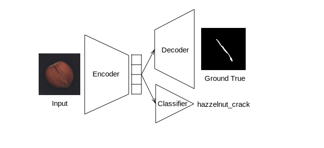

# Ranking Explainable AI Methods Using Pixel-Level Evidence in Classification Tasks

## Motivation

This project investigates the faithfulness of gradient-based explainable AI (XAI) methods in image classification using pixel-level ground-truth annotations.

We compare three popular explanation methods:

* **Grad-CAM**
* **Saliency Maps**
* **Integrated Gradients**

Unlike many qualitative XAI comparisons, this project evaluates explanations quantitatively using ground-truth segmentation masks from the MVTec AD hazelnut dataset.

A multitask learning model (autoencoder + classifier) is trained to:

* Perform defect classification
* Reconstruct defect masks at the pixel level

The explanation methods are then evaluated using a **Top-K Overlap (TKO)** metric, measuring how well highlighted pixels align with real defect regions.

## Model Architecture

The model is implemented in `custom_model_mvt.py`  and consists of:

* Encoder: Pretrained EfficientNet-B0 (no freezed)
* Decoder: Convolutional transpose network for pixel reconstruction
* Classifier head: Linear layer for defect classification

The model performs multitask learning:

L = L_{CE} + \beta L_{reconstruction}

Where:

* Cross-entropy loss for classification
* Reconstruction loss for defect mask prediction
* β controls the trade-off




### Training Hyperparameters

| Parameter       | Value |
| --------------- | ----- |
| Epochs          | 30    |
| Batch size      | 32    |
| Learning rate   | 0.001 |
| β (loss weight) | 1     |
| Seeds           | 42, 43, 44, 45, 46, 47, 48, 49, 50, 51 |


## Dataset

We use a subset of the **MVTec AD** dataset (Hazelnut category).

Each image contains:

* Image-level class label
* Pixel-level defect mask

Classes:

* `crack`
* `cut`
* `good`
* `hole`
* `print`

Dataset handling is implemented in `custom_dataset_mvt.py` .

If the dataset is not automatically downloaded when running the code, download it from:
```
https://seafile.cloud.uni-hannover.de/f/d007fcef288648378676/?dl=1
```
Then unzip it into the `data` directory with the folder name `MVTec_dataset`.

## Explanation Methods

Implemented in `get_explanations.py` :

#### Grad-CAM

* Uses gradients w.r.t. final convolutional feature maps
* Produces structured, object-level explanations

#### Saliency Maps

* Computes gradients w.r.t. input pixels
* Sensitive to local perturbations

#### Integrated Gradients

* Integrates gradients along a path from baseline to input
* Reduces gradient saturation issues

## Evaluation Metric Top-K Overlap (TKO)

For each image:

1. Let K be the number of defect pixels in the ground-truth mask.
2. Select the Top-K highest attribution pixels from the explanation map.
3. Compute he number of selected Top-$K$ pixels that fall within the ground-truth defect region.

The method with highest TKO wins for that image.

Implemented in `run_mvt.py` .


## Experimental Results

Experiments were run over:

* 10 random seeds
* 30 training epochs
* Balanced accuracy evaluation


##### Model performance averaged over 10 random seeds (Epoch 30)

| Split | Loss Total | Loss CE | Loss BCE | Balanced Accuracy |
|-------|------------|---------|----------|-------------------|
| Train | 0.0631 ± 0.0530 | 0.0581 ± 0.0527 | 0.0050 ± 0.0007 | 0.9837 ± 0.0144 |
| Test  | 0.2087 ± 0.1745 | 0.2006 ± 0.1736 | 0.0081 ± 0.0014 | 0.9443 ± 0.0467 |


#### Key Findings

* Grad-CAM dominates
* Win-rate consistently above ~80–95%
* Integrated Gradients ranks second
* Saliency Maps perform worst

Grad-CAM benefits from high-level semantic feature maps, while SM and IG operate directly on noisy input gradients.


#### Win-rate averaged over 10 random seeds

| Split | Class   | GC               | SM               | IG               |
|--------|---------|------------------|------------------|------------------|
| Train | Overall | **0.8713 ± 0.0678** | 0.0486 ± 0.0382 | 0.0801 ± 0.0564 |
| Train | Crack   | **0.9104 ± 0.0740** | 0.0591 ± 0.0543 | 0.0305 ± 0.0495 |
| Train | Cut     | **0.7968 ± 0.1119** | 0.0160 ± 0.0321 | 0.1872 ± 0.1181 |
| Train | Hole    | **0.8643 ± 0.1445** | 0.1143 ± 0.1204 | 0.0214 ± 0.0327 |
| Train | Print   | **0.9077 ± 0.1278** | 0.0000 ± 0.0000 | 0.0923 ± 0.1278 |
| Test  | Overall | **0.9017 ± 0.0739** | 0.0192 ± 0.0405 | 0.0792 ± 0.0712 |
| Test  | Crack   | **0.9167 ± 0.1291** | 0.0333 ± 0.1000 | 0.0500 ± 0.1000 |
| Test  | Cut     | **0.8250 ± 0.1601** | 0.0000 ± 0.0000 | 0.1750 ± 0.1601 |
| Test  | Hole    | **0.9250 ± 0.1601** | 0.0500 ± 0.1500 | 0.0250 ± 0.0750 |
| Test  | Print   | **0.9500 ± 0.1000** | 0.0000 ± 0.0000 | 0.0500 ± 0.1000 |


## Core Files

| File                     | Description                       |
| ------------------------ | --------------------------------- |
| `main_mvt.py`            | Runs full experiment across seeds |
| `config.py`              | Hyperparameters & path management |
| `custom_dataset_mvt.py`  | Multitask dataset loader          |
| `custom_model_mvt.py`    | EfficientNet autoencoder model    |
| `get_explanations.py`    | Grad-CAM, SM, IG implementations  |
| `run_mvt.py`             | Training, evaluation, ranking     |


## Installation

```bash
git clone https://github.com/khoaphamanh/project_iml.git
cd project_iml
```

Create environment:

```bash
conda create -n xai_env python=3.11.11
conda activate xai_env
```

Install dependencies:

```bash
pip install -r requirements.txt
```

## Running the Project

Run full experiment:

```bash
python main_mvt.py
```

This will:

* Download dataset
* Train model (if not pretrained)
* Evaluate across 10 seeds
* Compute win-rates
* Generate plots
* Launch interactive Top-K visualization dashboard

Note: We provide pretrained model weights in `mvt/pretrained_models`. If you want to run the project from scratch, remove this folder. Otherwise, the code will use the pretrained weights and compute statistics and metrics based on them.


### Outputs

Generated results include:

* Accuracy & loss plots
* Win-rate boxplots
* Per-image Top-K visualization (SVG, PNG, HTML)
* Saved model weights
* Serialized metrics
* Interactive dashboard launches an interactive Panel dashboard where you can:
    * Select train/test split
    * Select defect class
    * Choose image index
    * Compare GC / SM / IG explanations
    * View ranking & TKO scores


## Limitations

* Grad-CAM only applicable to CNN architectures
* Evaluation depends on segmentation quality
* Tested only on hazelnut subset

## Future Work

* Extend to video-based defect detection
* Compare with transformer-based explanations
* Add deletion/insertion metrics
* Explore robustness under adversarial perturbations


## References

* Selvaraju et al., Grad-CAM (2019)
* Simonyan et al., Saliency Maps (2013)
* Sundararajan et al., Integrated Gradients (2017)
* Tan & Le, EfficientNet: Rethinking Model Scaling for Convolutional Neural Networks (2019)
* MVTec AD Dataset (2019)

## Author

Anh Khoa Pham

Group: vibe_coding_scientist

Interpretable Machine Learning Course

Email: pham.anhkhoa1215@gmail.com
